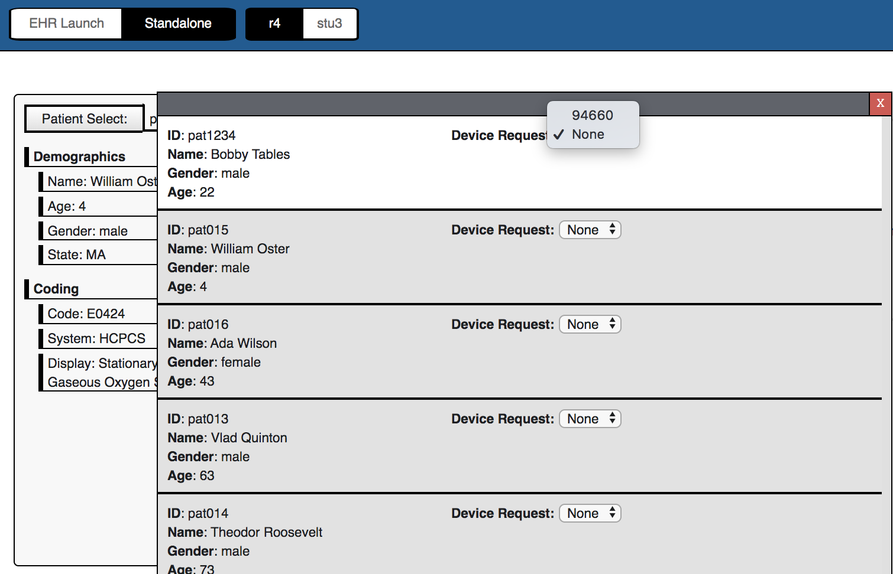

# DRLS Suite on Docker

## Version 0.2-alpha1 - Work In Progress - MacOS X Only

The goal of version 0.2 is to make it as easy as possible for anyone to start using/testing the DRLS Suite. The current version is 0.2-alpha1.

**Note this is a work in progress!!!** We have tested this on our own Mac OS X machines, but currently make no guarantees that it will work in other configuratoin. See [Known Bugs](#known_bugs) below.

Use this suite for trying or testing the DRLS Suite and to report bugs to the development team. Once everything is ready, it will be moved to the official repository.

## Known bugs

- The following components are not available when you `docker-compose up`:
  1.  `test-ehr`
  2.  `dtr`
- Windows 10

  - when running in VirtualBox on a Mac OS X machine, we are unable to run this suite due to VT-x issues in Docker for Windows. This is a [known incompatibility](https://docs.docker.com/docker-for-windows/install/#what-to-know-before-you-install) issue between VirtualBox and Docker for Windows and cannot be fixed.

We are in the process of resolving these problems. In the meantime, follow the instructions below in [Getting Started](#getting_started) whch contains workarounds.

## Getting Started

### Pre-Requisites

You need to have the following installed:

- Docker — [follow these instructions](http://docker.io) to install Docker for your OS.
- git — [follow these instructions](https://git-scm.com/book/en/v2/Getting-Started-Installing-Git) to install `git` for your OS

### Settin Up

The intent is that a single `docker-compose up` will bring up the entire DRLS suite. However, in the current version, you will need to install additional developer tools.

1. Clone this **private MITRE repository**. It contains all the configurations you need to run the suite.

   1. Create a "DRLS base directory", and will assume it is `~/drls` in the instructions below.

      `git clone https://gitlab.mitre.org/DME-eRx/drls-docker.git ~/drls`

2. Start up the DRLS Suite.

   `docker-compose up`

   This will start up 4 of the 6 compoments in the suite and will take about 2-3 minutes plus downloading the docker images if this is the first time you are running, or if there is updated version.

   The remaining 2 components will need to be run locally, using the directions that follow.

   You will see the console output from all the services mixed together in the console.

3. Install local development tools

   1. install [SDKman](https://sdkman.io/) by following the directions [here](https://sdkman.io/). SDKman is a helpful tool that simplifies installing and uninstalling development tools. We will be using it to install Java and Gradle. SDKman is available for Mac OS X, Windows (via Cygwin), Linux, and other platforms.

   2. once SDKman is installed install Java and Gradle

      ```
      sdk install java 8.0.232.hs-adpt
      sdk use java 8.0.232.hs-adpt

      sdk install gradle 6.3
      sdk use gradle 6.3
      ```

      You can install later versions, but the Suite was only tested using these.

4. Create a DRLS-Local directory. We will assume it is `~/drls-local` in the instructions below.

5. Go into the DRLS-Local directory

   `cd ~/drls-local`

6. Get all of the source code we will be running locally (outside of a container) using `git`:

   1. `git clone https://github.com/HL7-DaVinci/test-ehr.git`
   2. `git clone https://github.com/HL7-DaVinci/dtr.git`

7. Start the `test-ehr` server in a new console

   ```
   cd ~/drls-local/test-ehr
   gradle appRun
   ```

8. Start the `dtr` server in a new console

   ```
   cd ~/drls-local/dtr`
   npm install #only needed if running for the first time
   npm start
   ```

9. If you have not run `test-ehr` before, goto the [Adding Test Resources section](#adding_test_resources) below.
   Once the output for the init sequence for each app completes (about another 3 minutes), you will be able to reach all of the services via a browser:

| URL                            | `service_name`          | Description                                                           |
| ------------------------------ | ----------------------- | --------------------------------------------------------------------- |
| http://localhost:8090          | `crd`                   | Coverage Requirements Discovery (CRD) Reference Implementation (RI)   |
| http://localhost:8080/test-ehr | -                       | Electronic Health Record (EHR) Server                                 |
| http://localhost:8180          | `keycloak`              | [Identity and Access Management](https://www.keycloak.org/about.html) |
| http://localhost:3000          | `crd-request-generator` | Small application to generate CRD requests                            |
| http://localhost:3005          | -                       | Documentation Templates and Rules (DTR) - SMART on FHIR Application   |
| http://localhost:3009          | `admin`                 | DRLS Admin server                                                     |

- To see the logs of an individual service, run `docker-compose logs <service_name>` in a separate console

### Adding Test Resources

The DRLS suite is empty by default. To add resources:

1. Wait for all the services to finish running (about 3 minutes after running `test-ehr`). They are finished running when the console logs for `test-ehr` stops scrolling.
2. Point a browser to the [upload resource](http://localhost:3009/init_ehr) page. This will trigger an upload of the default set of resources to the `test-ehr` server.
3. When the page responds with `done`, you should be able to see a list of resources added to the EHR by going to the [search patients page](http://localhost:8080/test-ehr/search?serverId=home&pretty=true&resource=Patient).
4. To fully test that the DRLS Suite is up and running
   1. Point a browser to http://localhost:3000
   2. Click on the `Standalone` and `R4` buttons to use the DRLS Suite's R4 server
   3. Click on `Patient Select` and you should see the following screen 

### Configurations and Customizations

The easiest way to run the DRLS Suite is to get the docker images from docker hub and orchestrate the images using the `docker-compose.yml` file included in the root project. Along with the `docker-compose.yml` file is a `.env` file. (Note this file may be invisible in your file system, you will need to do a `ls -a` to see it.) The `.env` file contains all the environment variables that you can change to customize the suite.

These 2 files provide the defaults for running the DRLS suite for a local development machine. If you choose, you can customize the suite in the `.env` file, or append the configuration before the command line, (e.g., `DRLS_NAMESPACE=XYZ docker-compose up`, where `XYZ` is your custom namespace)

The versions on docker hub follows the following conventions

- `alpha1` - most recent `0.2-alpha1` series (see [Roadmap](#roadmap))

## Stopping the DRLS Suite

To stop the entire DRLS suite and remove the stopped containers

1. in a separate console, run `docker-compose down`
2. in the console you used to run `test-ehr`, type `Ctrl-C`
   1. it may take a few seconds for the container to stop
   2. once you get the console prompt, the server has stopped
3. in the console you used to run `dtr`, type `Ctrl-C`
   1. it may take a few seconds for the container to stop
   2. once you get the console prompt, the server has stopped

## Information for Developers

### `shared-with-container` Files

Several components have a `shared-with-container` directory which is useful for changing configurations and developing some new features (e.g., adding new records to the EHR, modifying rule sets in CRD). If the changes are temporary, you do not need to do anything. However, if you want the changes to be available for other users, there are 2 different paths, depending on whether the changes applies only to Docker users or to all users (i.e., users who run that component locally).

If the changes are

- for Docker users only: commit the changes (be sure NOT to commit any secrets or local-only data such as proxy settings).
- for all users:
  1.  commit the changes (be sure NOT to commit any secrets or local-only data such as proxy settings).
  2.  Copy the changes to the appropriate place in the stand-alone projects, and commit them there.
      - you can use the `volume:` key in the `docker-compose.yml` file and the `##### GIT #####` portion of the component's `Dockerfile` to find where the change should be made and which stand-alone project to use.

### Docker-Compose Commands

In general, running `docker-compose <command>` will run the `<command>` and show its output while running the DRLS suite. For example,

- `docker-compose logs <service_name>` will show the `stdout` and `stderr` for the specified `<service_name>`
- `docker-compose ps` will show all containers currently running in the DRLS suite. (You can also use `docker ps` which will show all containers running in your system. And of course, running `ps`, will show all processes running in your system.)
- `docker-compose top` will show all running threads associated the DRLS suite

### Verify configurations in containers

Most configurations have been moved to the `<component>/shared-with-container` subdirectories, but to verify you can use the traditional way of running docker or docker-compose exec to the appropriate locations.

These need to run at the root project level (where the main `docker-compose.yml` file resides )

- `test-ehr`

  - check the FHIR server properties:

    `docker-compose exec test-ehr cat /home/test-ehr/src/main/resources/fhirServer.properties`

### Publishing Tools

The `publish.sh` bash shell is a simple tool to help publishing locally generated docker images for this suite to docker hub. To use it, run

`./publish.sh drls 0.2-alpha1 hkong2 alpha1`

where

- parameter 1 is the local namespace
- parameter 2 is the local version
- parameter 3 is the remote namespace
- parameter 4 is the remote version

## Technology Dependency

Since we are eventually deploying to Portainer, we are matching the container technology stack used there, specifically,

- Docker Compose 2 (follow [issue 1](https://github.com/portainer/portainer/issues/2986), and see the [To Do](#to-do) section below)
- Used [this template project](https://github.com/portainer/portainer-compose) as starting point for the compose files

## Roadmap

The current intentions for the Roadmap. Note this will likely change depending on sponsor requirements

- 0.2 - the 0.2 series is intended to make it as simple as possible for anyone to start using/testing the DRLS Suite.

  - 0.2-alpha1 - Minimally Viable Product on Mac OS X — meets goal, but with workarounds
    - 0.2a-alpha1 - containerized EHR works with rest of docker-compose suite
    - 0.2b-alpha1 - all containers work with docker-compose suite with keycloak up
    - 0.2c-alpha1 - all containers work with docker-compose suite without keycloak
  - 0.2-alpha2 - Meets goal on Mac OS X and Windows 10, with minimum workarounds, plus
    - multi-layer docker builds
    - ready for in-house testing
  - 0.2-beta - Same as 0.2-alpha2, but ready for general testing inside and outside of MITRE
  - 0.2 - release

- 0.3 - the 0.3 series will make it easier for developers to modify and run their code, both within docker and directly compiling locally,

  - automatic image builds from DRLS `master` source changes (still requires manual oversight to change suite's `latest` version)
  - CI/CD

- 1.0 - the 1.0 series will fully support single start up using `docker-compose up`, plus

  - Portainer support

- Docker Compose 3 is apparently now supported by portainer, but only for swarms. Once we have all the services dockerized, we'll explore this. For now, we're sticking to just version 2
