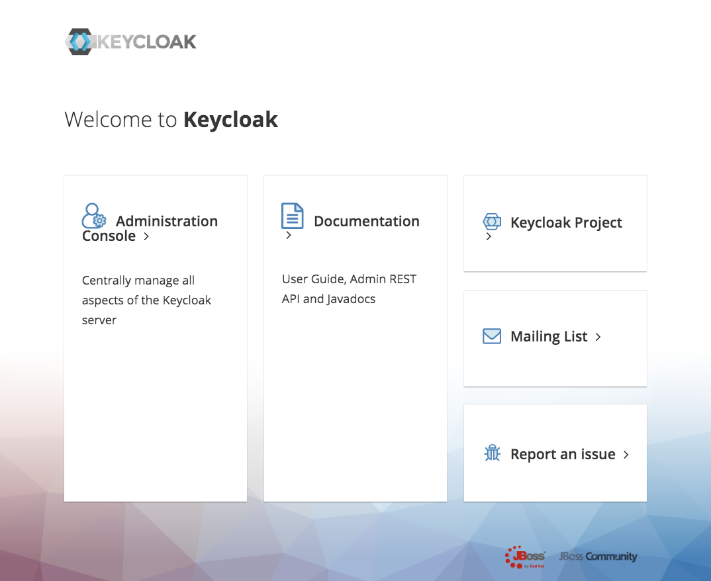
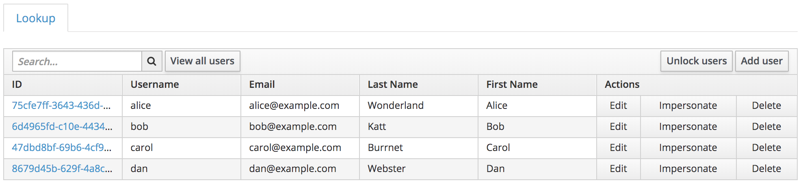
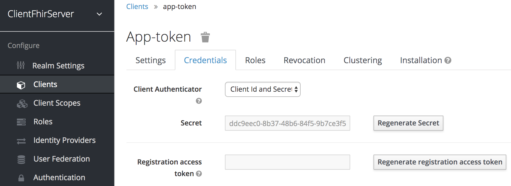
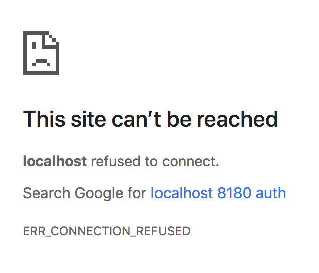
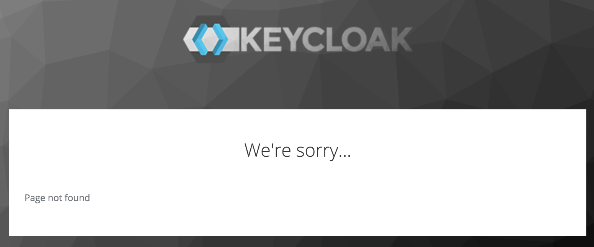

# Keycloak for DRLS

[Keycloak](https://www.keycloak.org/index.html) is an Open Source Identity and Access Management solution for modern Applications and Services. This is a fork of [the official docker image](https://hub.docker.com/r/jboss/keycloak) which configures the container to be used as a drop-in-place starting point for a DRLS development installation.

## Pre-requisites

The only pre-requisite is [docker](https://www.docker.com/) running on your OS.

## Getting Started

To run Keycloak for DRLS, run:

`docker run --name keycloak -p 8180:8080 --rm -e DB_VENDOR=h2 -e KEYCLOAK_USER=admin -e KEYCLOAK_PASSWORD=admin hkong2/keycloak:0.2-alpha1`

You should change the `KEYCLOAK_USER` and `KEYCLOAK_PASSWORD` to something more secure.

To verify the keycloak instance, point a browser to `http://localhost:8180`. You should see this:



Refer to the [Diagnostics section](#Diagnostics) below if you do not see this screen.

Once the container is running, you should not need to do additional configuration to make this work in a DRLS development setup.

## Configuration

This docker image installs the keycloak realm defined by `config/ClientFhirServerRealm.json`. This is used to protect the `ehr-server`. It adds the following configuration for DRLS development.

- Users
  - 
    - all user passwords are the same as their username (e.g., `alice`'s password is `alice`)
    - all users were added to the `user` role
- Clients
  - 2 clients were added for DRLS (Clients tab)
    - `app-login` is a "public" client
      - The Web Origins for this client is set to `*`, which assumes all the servers are running locally and should only be used for development. If that is not the case, change it to the URL of the EHS-server
      - The rediret URL is set to http://localhost:8080
    - `app-token` is a 'bearer-only' client
    - There are other clients from the standard installation, but they are not used

### Settings in Other Systems

For development, this keycloak server uses a preconfigured secret for use with the EHR Server and CRD Request Generator. For development, this is sufficient, but if you want to change this

1. Point your browser to [the credentials page for app-token client](http://localhost:8180/auth/admin/master/console/#/realms/ClientFhirServer/clients/11c7d028-8a86-4ea0-8f51-9ac00954ecbd/credentials) and copy the secret 
2. In `ehr-server/src/main/resources/fhirServer.properties`, change the value to `client_secret` to the secret you copied (replacing `#replaceMe#)
3. In `request-generator/src/properties.json`, change the following:
   1. `"realm": "ClientFhirServer"`
   2. `"client": "app-login",`
   3. `"user"` and `"password"` should be one of the users in the screen shot above
   4. This is an example:
   ````{
   "realm": "ClientFhirServer",
   "client": "app-login",
   "auth": "http://localhost:8180/auth",
   "server": "http://localhost:8090",
   "ehr_server": "http://localhost:8080/ehr-server/r4/",
   "cds_service": "http://localhost:8090/r4/cds-services/order-review-crd",
   "ehr_server_stu3": "http://localhost:8080/ehr-server/stu3/",
   "cds_service_stu3": "http://localhost:8090/stu3/cds-services/order-review-crd",
   "true_base": "http://localhost:8080/ehr-server",
   "user": "alice",
   "password": "alice"
   }```
   ````

## Exporting the KeyCloak Configuration

The `config/ClientFhirServerRealm.json` file is generated from a running instance of the keycloak server. If you modify the server and want to export a new JSON file

1. `cd` to this project's root (where this README can be found)
2. Run keycloak with the extra parameter `-v <full path to local config directory>:/config`. That is, run `docker run --name keycloak -p 8180:8080 -e KEYCLOAK_USER=admin -e KEYCLOAK_PASSWORD=admin --rm -v /Users/hkong/keycloak-container/config:/config drls/keycloak`. This will mount the local directory as `config` in the container.
3. In a separate console window, run `docker exec -it keycloak /bin/bash` to "tap" into the running container and launch the bash shell
4. cd to `/opt/jboss/keycloak/bin`
5. from inside the bash shell, run `./standalone.sh -Djboss.socket.binding.port-offset=500 -Dkeycloak.migration.action=export -Dkeycloak.migration.provider=singleFile -Dkeycloak.migration.realmName=ClientFhirServer -Dkeycloak.migration.usersExportStrategy=REALM_FILE -Dkeycloak.migration.file=/config/ClientFhirServerRealm.json`.
6. When the console stops scrolling with status (about 30 seconds), press Ctrl-C to stop the export. The exported configuration is now in the mounted volume `config` overwriting `ClientFhirServerRealm.json` if it exists.

To make a new docker image with this configuration, follow the steps in the next section.

## Building the Docker Image

To build the docker image, run from this project's root (where `Dockerfile` s located):

`docker build . --tag hkong2/keycloak:0.2-alpha1`

adjusting `0.2-alpha1` to the version you like.

## Diagnostics

These are some common problems and their solutions.

| Screen Shot                                                                                         | Description                                                                                                                 | Mitigation                                                                                                                                                            |
| --------------------------------------------------------------------------------------------------- | --------------------------------------------------------------------------------------------------------------------------- | --------------------------------------------------------------------------------------------------------------------------------------------------------------------- |
| **_KeyCloak Server_**                                                                               |                                                                                                                             |                                                                                                                                                                       |
|     | Connection Refused — docker/keycloak is not running                                                                         | Run the docker command in the Getting Started section.                                                                                                                |
|                                                                                                     | The port may already be in use, preventing the server from starting                                                         | Change the port in the docker command                                                                                                                                 |
| **_Smart-on-FHIR apps_**                                                                            |                                                                                                                             |                                                                                                                                                                       |
|  | docker/keycloak is running, but your user does not have authorization to see the page (or the page does not actually exist) | Make sure you are logged in as a user who has credentials to see that page.                                                                                           |
|                                                                                                     |                                                                                                                             | If you are using the CRD Request Generator, make sure `request-generator/src/properties.json`, has the right values for `"user"` and `"password"`. See Configuration. |

## Additional Official Documentation

For additional documentation on how to use and configure keycloak, refer to the [keycloak docker image page](https://hub.docker.com/r/jboss/keycloak), and the [keycloak documentation page](https://www.keycloak.org/documentation.html)
